The Relationship between Deprivation & Health Outcomes
================
Paul Johnson
2022-09-07

<script src="01-deprivation_files/libs/kePrint-0.0.1/kePrint.js"></script>
<link href="01-deprivation_files/libs/lightable-0.0.1/lightable.css" rel="stylesheet" />


- [Frequentist Vs Bayesian Statistics: A
  Primer](#frequentist-vs-bayesian-statistics-a-primer)
- [Visual Exploration of Deprivation and Health Inequalities
  Data](#visual-exploration-of-deprivation-and-health-inequalities-data)
- [Linear Regression the Frequentist
  Way](#linear-regression-the-frequentist-way)
- [Bayesian Regression](#bayesian-regression)
  - [Setting Priors](#setting-priors)
  - [Specify Stan Model](#specify-stan-model)
  - [Diagnostic Checks](#diagnostic-checks)
  - [Posterior Checks](#posterior-checks)
  - [Estimated Parameter Values](#estimated-parameter-values)
- [Explore Stan Model Using Shiny](#explore-stan-model-using-shiny)

## Frequentist Vs Bayesian Statistics: A Primer

At its core, Frequentist vs Bayesian differences lie in the definition
of probability.

Frequentists think of probability in terms of frequencies. The
probability of an event is a measure of the frequency of that event
after repeated measurements. Bayesians, however, incorporate uncertainty
as a part of probability.

For Bayesians, probability is an attempt to define the plausability of a
proposition/situation.

In Bayesian statistics, the p-value is not a value, but a distribution
(or in reality, the p-value is not relevant).

At a very basic level, the fundamental difference between the
Frequentist and Bayesian frameworks are that Bayesian inference includes
any prior expectations and knowledge that can help in drawing
inferences.

Frequentist probability - If you ran the same simulation again and
again, the probability that you observe the outcome

Bayesian probability

In reality, I think that Bayesian approaches to probability are a lot
more intuitive than Frequentist approaches. You have to train your mind
to think like a Frequentist, whereas our natural way of understanding
probabilities is inherently Bayesian.

## Visual Exploration of Deprivation and Health Inequalities Data

``` r
deprivation_df %>%
  psych::describe() %>%
  filter(!row_number() %in% c(1, 2)) %>%
  select(
    -vars, -n, -trimmed, -mad,
    -skew, -kurtosis, -se, -range
  ) %>%
  relocate(sd, .after = median) %>%
  kableExtra::kbl() %>%
  kableExtra::kable_styling(
    bootstrap_options = c("striped", "hover", "condensed"),
    fixed_thead = T
  )
```

[TABLE]

``` r
deprivation_df %>%
  ggplot(aes(life_expectancy, imd_score)) +
  geom_point()
```

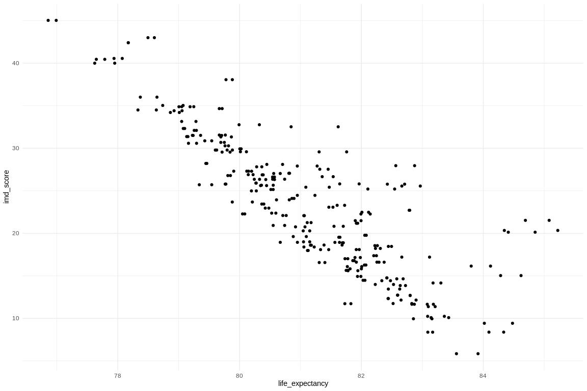

``` r
deprivation_df %>%
  ggplot(aes(life_expectancy, physiological_risk_factors)) +
  geom_point()
```

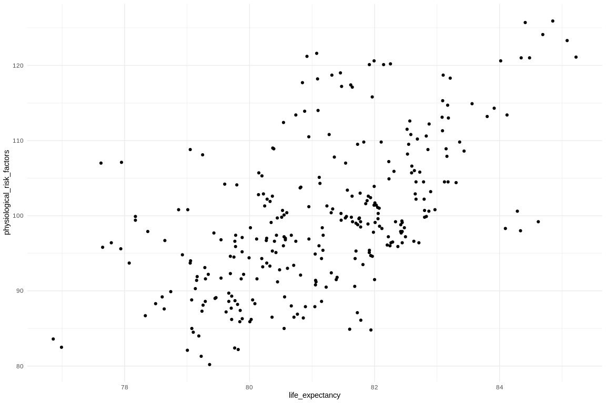

``` r
deprivation_df %>%
  ggplot(aes(life_expectancy, behavioural_risk_factors)) +
  geom_point()
```

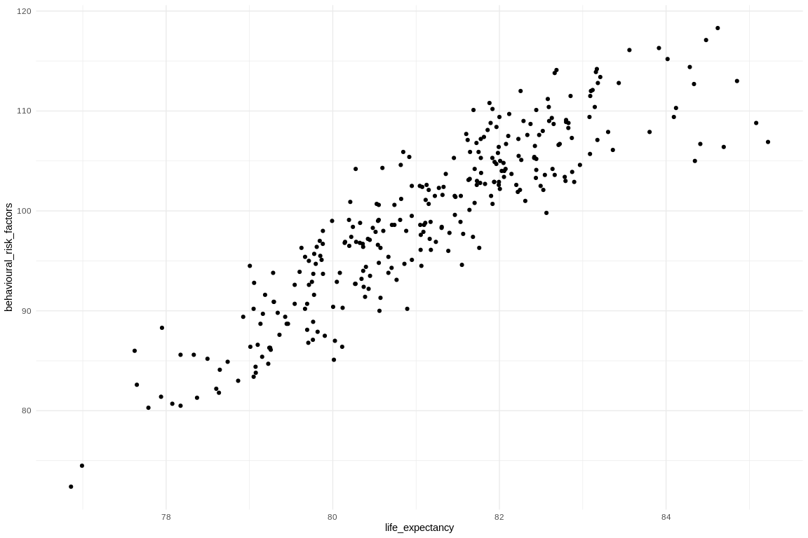

``` r
deprivation_df %>%
  select(
    life_expectancy,
    physiological_risk_factors,
    behavioural_risk_factors,
    imd_score
  ) %>%
  group_by(area_code) %>%
  summarise_all(.funs = "mean") %>%
  correlation::correlation(bayesian = TRUE) %>%
  summary() %>%
  kableExtra::kbl() %>%
  kableExtra::kable_styling(
    bootstrap_options = c("striped", "hover", "condensed"),
    fixed_thead = T
  )
```

[TABLE]

There are strong correlations between life expectancy and the three
independent variables, however, the correlation between IMD score and
the two risk factor variables is also relatively strong, and in the case
of behavioural risk factors, it is very strong. This could be an issue.

``` r
deprivation_df %>%
  ggplot(aes(imd_score, physiological_risk_factors)) +
  geom_point()
```

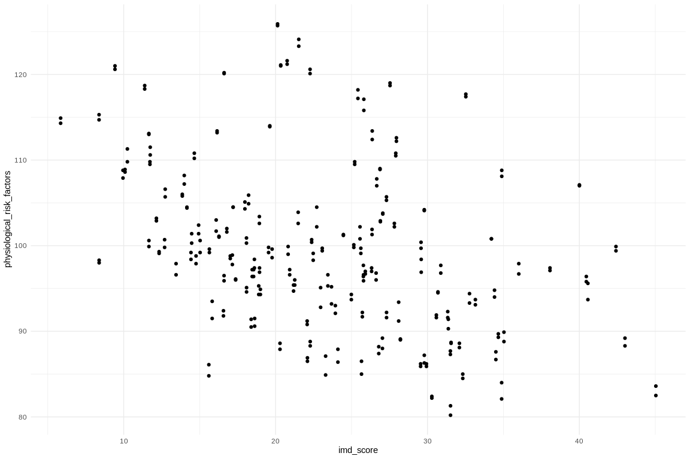

``` r
deprivation_df %>%
  ggplot(aes(imd_score, behavioural_risk_factors)) +
  geom_point()
```

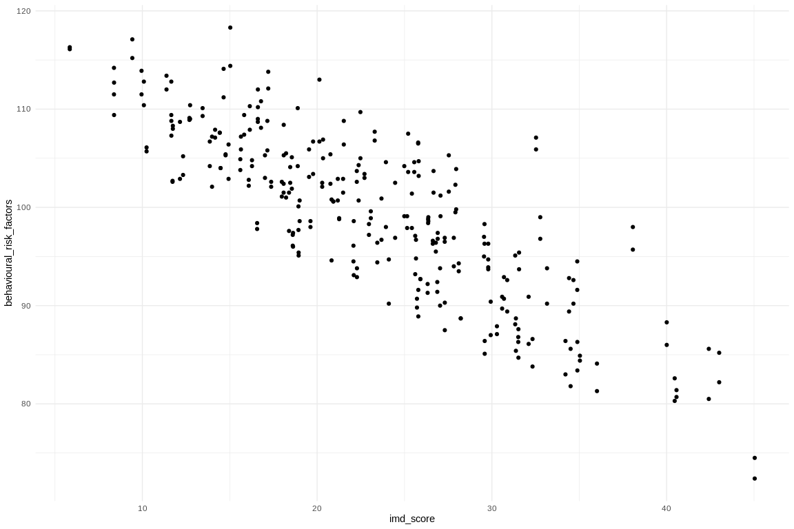

``` r
deprivation_df %>%
  mutate(imd_decile = as.factor(imd_decile)) %>%
  ggplot(aes(physiological_risk_factors, imd_decile)) +
  ggridges::geom_density_ridges()
```

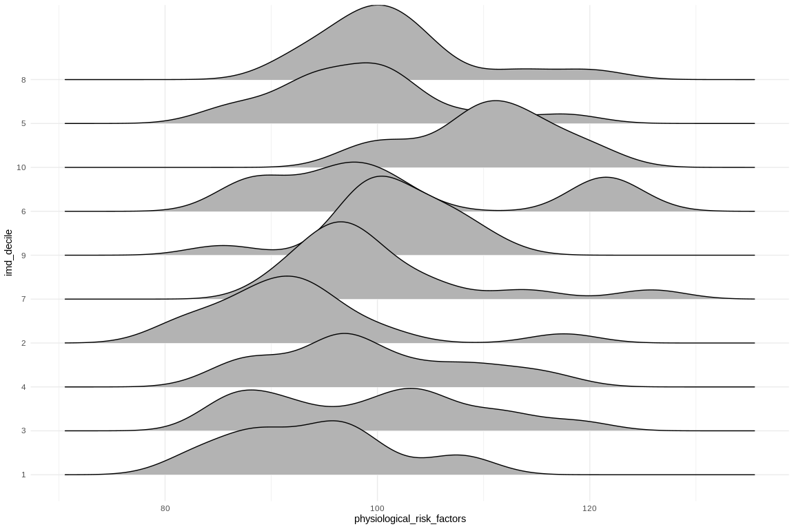

``` r
deprivation_df %>%
  mutate(imd_decile = as.factor(imd_decile)) %>%
  ggplot(aes(behavioural_risk_factors, imd_decile)) +
  ggridges::geom_density_ridges()
```

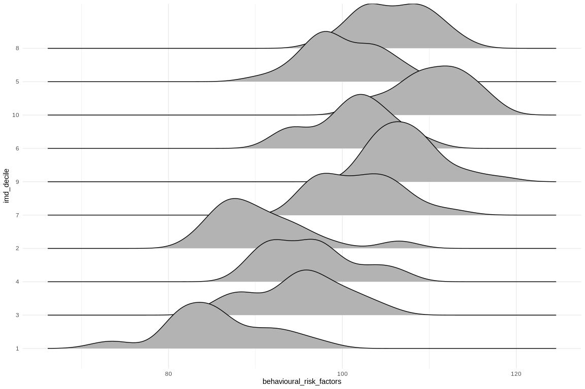

The correlations are a little more obvious when plotted and inspected
visually. The behavioural risk factors have a positive linear
relationship with IMD (as the value of the risk factor goes up, so does
IMD score/decile).

## Linear Regression the Frequentist Way

First we will transform each of the explanatory variables to make them a
little easier to interpret (particularly with regard to the intercept).

These transformations won’t impact the regression results, but will just
make the results easier to explain, as the intercept is no longer based
on zero values of each explanatory variable (which are effectively
meaningless, especially in the Health Index variables).

``` r
mean_imd <- mean(deprivation_df$imd_score)

deprivation_df <-
  deprivation_df %>%
  mutate(
    imd_transformed = imd_score - mean_imd,
    physiological_transformed = physiological_risk_factors - 100,
    behavioural_transformed = behavioural_risk_factors - 100
  )
```

The frequentist regression is very easy to compute, using `lm()`.

``` r
life_expectancy_ols <-
  lm(life_expectancy ~ imd_transformed + physiological_transformed + behavioural_transformed,
    data = deprivation_df
  )

sjPlot::tab_model(life_expectancy_ols)
```

[TABLE]

The results suggest that each of the explanatory variables has a small
but significant effect on life expectancy. As deprivation increases (IMD
score increases), life expectancy decreases, while as the index score
representing physiological and behavioural risk factors (meaning a
better performance in that Health Index subdomain) increases, life
expectancy increases.

## Bayesian Regression

### Setting Priors

First we need to come up with some priors. Given everything we already
know about life expectancy at birth and the effect that deprivation has
on health outcomes, we should be able to constrain our prior
distribution in relatively informative ways.

First, we would expect life expectancy at birth to be normally
distributed around 80.

With IMD scores, we can reasonably expect that we should observe a
negative relationship on health outcomes as deprivation increases,
meaning that as IMD scores increase (meaning higher deprivation), life
expectancy should decrease. The effect is unlikely to be huge, so we
will conservatively estimate that each one unit increase in IMD score
will be associated with a one unit decrease in life expectancy at birth.
The key here is more the standard error, which we will constraint
sufficiently to mean that our prior is that deprivation will only have a
negative effect on life expectancy.

We have similar expectations of the physiological

``` r
life_expectancy_priors <-
  stan_glm(
    life_expectancy ~ imd_transformed + physiological_transformed + behavioural_transformed,
    data = deprivation_df,
    prior_intercept = normal(80, 1),
    prior = normal(location = c(-1, 1, 1), scale = c(0.25, 0.5, 0.25)),
    prior_PD = TRUE
  )
```

We can see a summary of our priors here:

``` r
# prior_summary(life_expectancy_priors)

# bayestestR::describe_prior(life_expectancy_priors)

life_expectancy_priors %>%
  bayestestR::describe_prior() %>%
  kableExtra::kbl() %>%
  kableExtra::kable_styling(
    bootstrap_options = c("striped", "hover", "condensed"),
    fixed_thead = T
  )
```

[TABLE]

The prior distributions look pretty sensible:

``` r
plot(life_expectancy_priors, "hist")
```

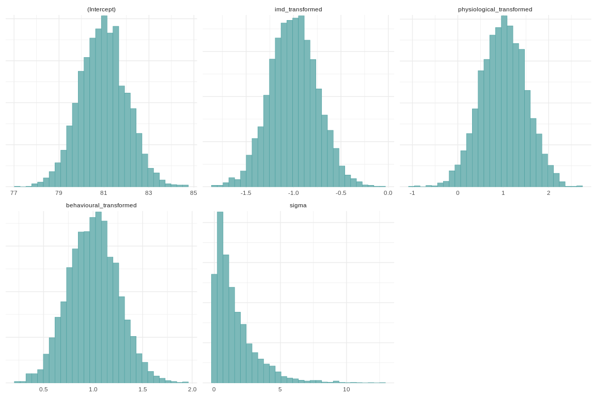

### Specify Stan Model

``` r
life_expectancy_glm <-
  stan_glm(
    life_expectancy ~ imd_transformed + physiological_transformed + behavioural_transformed,
    data = deprivation_df,
    prior_intercept = normal(80, 1),
    prior = normal(location = c(-1, 1, 1), scale = c(0.25, 0.5, 0.25))
  )
```

``` r
sjPlot::tab_model(life_expectancy_glm)
```

[TABLE]

### Diagnostic Checks

``` r
# bayestestR::sensitivity_to_prior(life_expectancy_glm)

life_expectancy_priors %>%
  bayestestR::sensitivity_to_prior() %>%
  kableExtra::kbl() %>%
  kableExtra::kable_styling(
    bootstrap_options = c("striped", "hover", "condensed"),
    fixed_thead = T
  )
```

[TABLE]

``` r
# bayestestR::diagnostic_posterior(life_expectancy_glm)

life_expectancy_priors %>%
  bayestestR::diagnostic_posterior() %>%
  kableExtra::kbl() %>%
  kableExtra::kable_styling(
    bootstrap_options = c("striped", "hover", "condensed"),
    fixed_thead = T
  )
```

[TABLE]

### Posterior Checks

``` r
# posterior predictive checks

life_expectancy_posterior <- as.matrix(life_expectancy_glm)

#
# bayesplot::ppc_dens_overlay(
#   y = life_expectancy_glm$y,
#   yrep = posterior_predict(
#     life_expectancy_glm,
#     draws = 50
#     )
#   ) +
#   labs(
#     title = "Posterior Predictive Checks Against Observed Data",
#     subtitle = "Samples Drawn from Posterior Predictive Distribution of Life Expectancy\nby IMD Score and Physiological & Behavioural Risk Factors",
#     x = "Life Expectancy"
#     ) +
#   theme(
#     legend.position = "top",
#     legend.text = element_text(size = 12)
#   )

life_expectancy_rep <- posterior_predict(life_expectancy_glm)

n_sims <- nrow(life_expectancy_rep)
subset <- sample(n_sims, 100)

bayesplot::ppc_dens_overlay(deprivation_df$life_expectancy, life_expectancy_rep[subset, ])
```

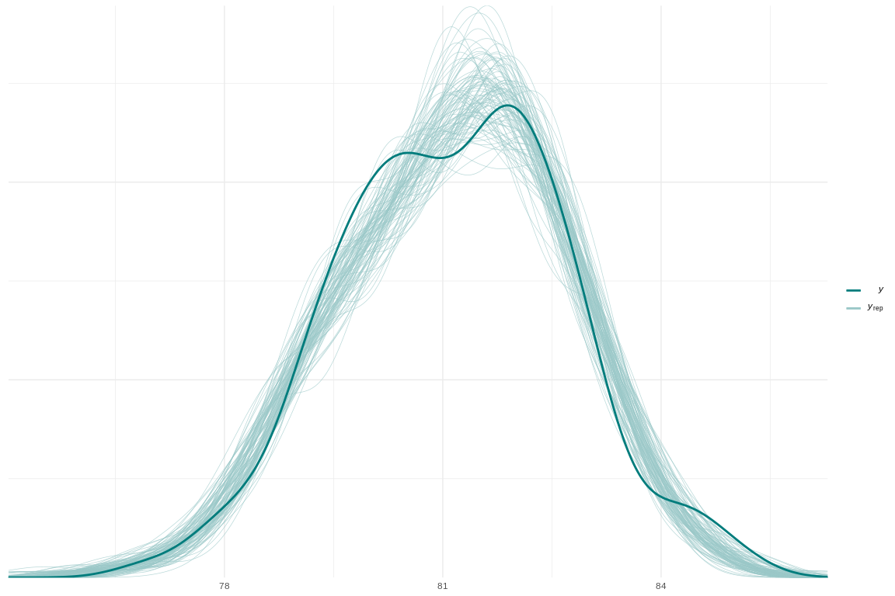

``` r
posterior_vs_prior(
  life_expectancy_glm,
  prob = 0.9,
  group_by_parameter = TRUE,
  facet_args = list(scales = "free")
) +
  scale_colour_viridis_d() +
  theme_minimal() +
  theme(
    legend.position = "top",
    legend.title = element_blank()
  )
```

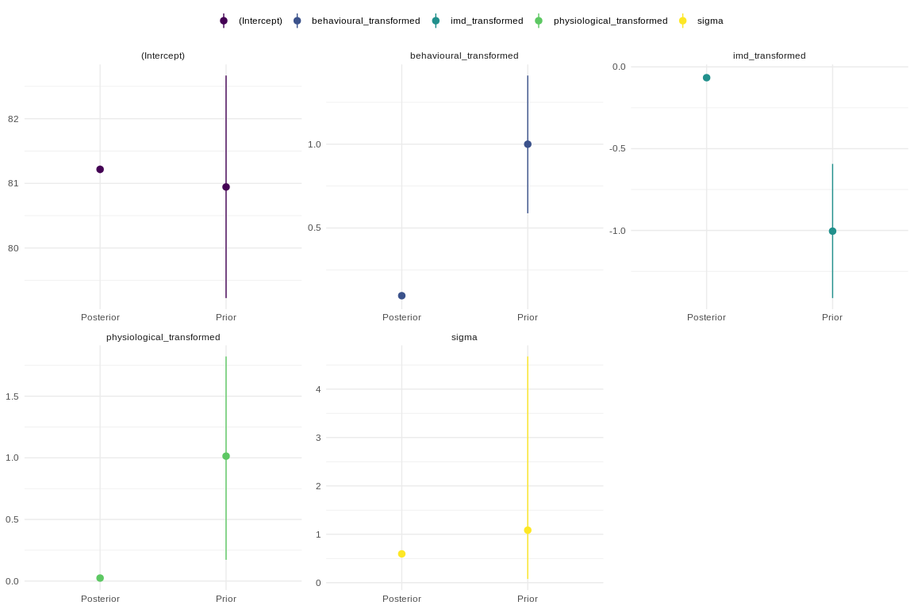

``` r
bayesplot::ppc_scatter_avg(
  deprivation_df$life_expectancy, life_expectancy_rep[subset, ]
)
```

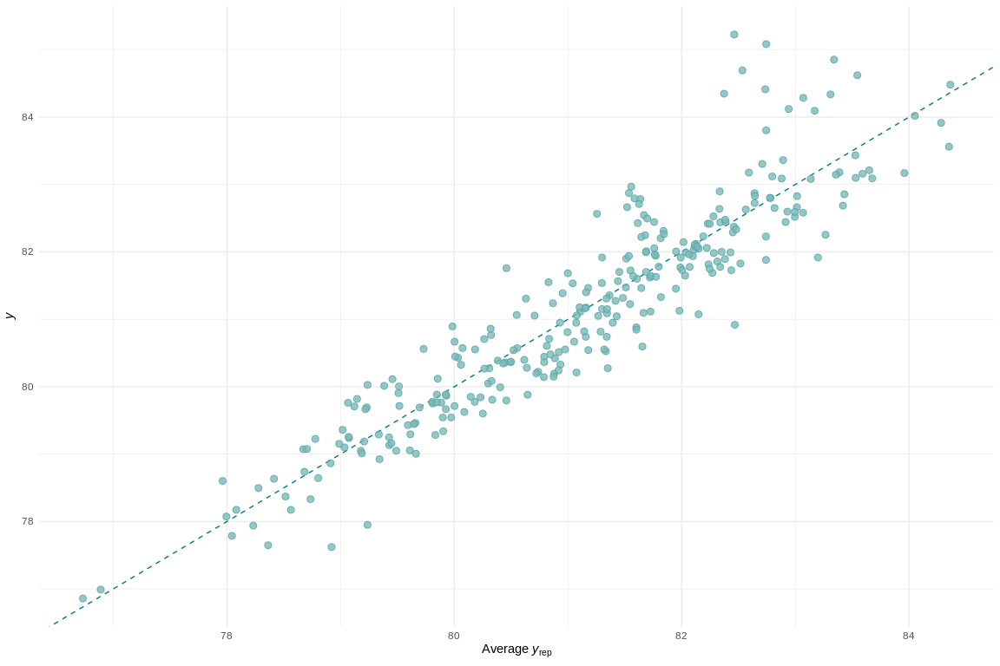

### Estimated Parameter Values

``` r
bayestestR::hdi(
  life_expectancy_glm,
  ci = c(
    0.5, 0.75, 0.89, 0.95
  )
) %>%
  plot()
```

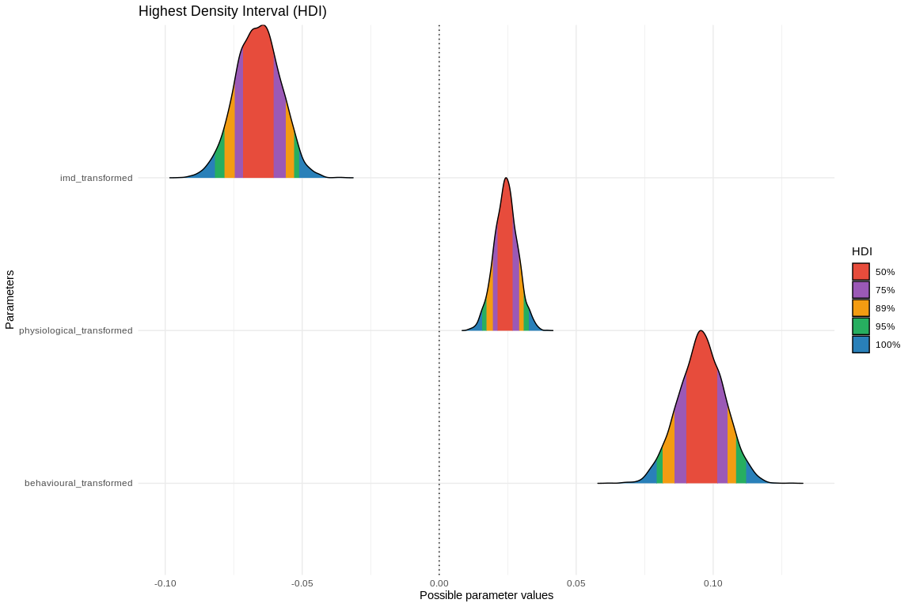

``` r
bayestestR::map_estimate(
  life_expectancy_posterior
) %>%
  plot()
```

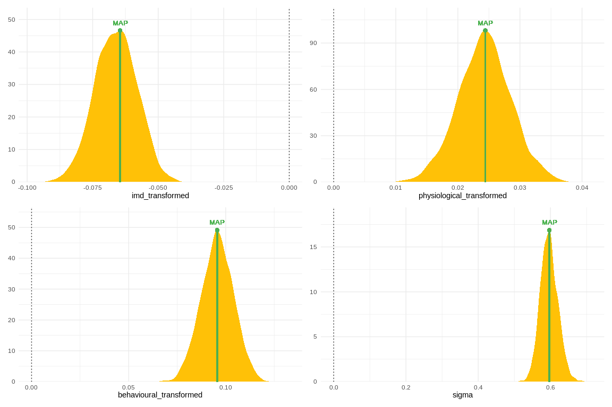

## Explore Stan Model Using Shiny

``` r
# doesn't run in quarto doc

# rstanarm::launch_shinystan(life_expectancy_glm)
```
